# ReqPilot by Airquire

> Elevate Your Requirements, Accelerate Your Flight.

ReqPilot is an agentic system that streamlines aerospace engineering requirements validation by automating the process of requirement analysis, comparison, and gap detection.

> **🚀 Elevator Pitch**
>
> **ReqPilot by Airquire** is revolutionizing aerospace engineering compliance by automating requirements validation. Our AI-powered platform ingests complex technical specifications and engineering responses, then uses advanced natural language understanding to identify gaps, misalignments, and ambiguities. Unlike traditional manual processes that take weeks, ReqPilot delivers comprehensive validation in minutes, reducing rework by 60% and accelerating development cycles. With Airquire, aerospace engineers can focus on innovation rather than documentation.

## Architecture Overview

```mermaid
graph TD
    User([👩‍💻 Aerospace Engineer]) -->|📤 Uploads Documents| Frontend[🖥️ Frontend]
    
    subgraph "ReqPilot Agent System"
        Steering(🤖 Steering Agent) -->|🗂️ Coordinates| ReqRefiner
        Steering -->|🗂️ Coordinates| DocIngester
        Steering -->|🗂️ Coordinates| GapAnalyzer
        Steering -->|🗂️ Coordinates| ReportGenerator
        
        ReqRefiner(🛠️🤖 ReqRefiner Agent) -->|✨ Improved Requirements| Steering
        DocIngester(📥🤖 Document Ingestion Agent) -->|🔎 Extracted Requirements| Steering
        GapAnalyzer(🕳️🤖 Gap Analysis Agent) -->|📈 Validation Results| Steering
        ReportGenerator(📑🤖 Report Generation Agent) -->|📝 Summary Reports| Steering
    end
    
    subgraph "Data Sources"
        DOORS[(💾 IBM DOORS)]
        PDFs[(📄 Response PDFs)]
    end
    
    subgraph "GCP Infrastructure"
        CloudStorage[(🗄️ Cloud Storage)]
        VertexAI[🧠 Vertex AI]
        BigQuery[(📊 BigQuery)]
        CloudRun[🚀 Cloud Run]
    end
    
    Frontend <-->|🔗 API Requests| CloudRun
    DOORS -->|📤 Requirements Export| DocIngester
    PDFs -->|📤 Response Documents| DocIngester
    
    DocIngester <--> CloudStorage
    ReqRefiner <--> VertexAI
    GapAnalyzer <--> VertexAI
    Steering <--> BigQuery
    
    CloudRun -->|🌐 Hosts| Frontend
    CloudRun -->|🌐 Hosts| Steering
```



## Key Features

- **Requirement Extraction**: Automatically extract requirements from IBM DOORS webservices and PDF documents
- **Quality Enhancement**: Improve requirement quality using the ReqRefiner agent
- **Gap Analysis**: Identify missing, ambiguous, or misaligned requirements
- **Reporting**: Generate comprehensive validation reports with remediation suggestions
- **Traceability**: Maintain complete traceability between source and response documents

## Business Value

- Reduce requirement-related rework by 60%
- Accelerate development cycles through automated validation
- Decrease supplier costs by eliminating redundant or poorly written requirements
- Enable engineers to create high-quality requirements regardless of writing proficiency
- Provide a modern, efficient alternative to slow legacy tools like IBM DOORS


## Project Setup Instructions

### 1. Set Up the Environment
- **Create and activate a Python virtual environment**:
  ```bash
  python -m venv .venv
  source .venv/bin/activate
  ```
- **Install the Google ADK**:
  ```bash
  pip install poetry
  poetry install
  ```

### 2. Create the Project Structure
The project structure is as follows:
```
e2eplm/
├── steering_agent/
│   ├── __init__.py
│   ├── agent.py
│   ├── .env
├── steering_agent/sub_agents/
│   ├── doc_ingester/
│   ├── gap_analyzer/
│   ├── req_refiner/
│   ├── report_generator/
```

### 3. Define the Agent
The `steering_agent` is designed to centralize the workflow between specialized agents. It acts as a coordinator, delegating tasks to specific tools or agents based on the input and ensuring seamless integration of their outputs.

### 4. Set Up the `.env` File (optional)
- Add the following to `steering_agent/.env`:
  ```properties
  GOOGLE_GENAI_USE_VERTEXAI=FALSE
  GOOGLE_API_KEY=YOUR_API_KEY_HERE
  GOOGLE_CLOUD_PROJECT=YOUR_GCP_PROJECT_ID
  GOOGLE_CLOUD_LOCATION=us-central1
  GOOGLE_CLOUD_STORAGE_BUCKET=YOUR_BUCKET_NAME
  MODEL=gemini-2.0-flash-001
  ```
- Replace `YOUR_GCP_PROJECT_ID` and `YOUR_BUCKET_NAME` with your actual project ID and bucket name. You can find the project ID in the Google Cloud Console under **Home > Project Info** or by running the following command in the `gcloud` CLI:
  ```bash
  gcloud config get-value project
  ```

### 5. Workaround for Elevated Permission Error on Windows
If you encounter the error `OSError: [WinError 1314] A required privilege is not held by the client`, follow these steps:

1. Navigate to the file `.venv\Lib\site-packages\google\adk\cli\cli_tools_click.py`.
2. Locate the `cli_run()` function.
3. Comment out the line that says:
```python
latest_log_link = os.path.join(log_dir, f'{log_file_prefix}.latest.log')
if os.path.islink(latest_log_link):
  os.unlink(latest_log_link)
os.symlink(log_filepath, latest_log_link)

print(f'To access latest log: tail -F {latest_log_link}')
```
4. Save the file and rerun your agent.

Alternatively, you can start your terminal with administrative privileges to avoid this issue.

### 6. Run the Agent
- Using command line:
   ```bash
   adk run steering_agent
   ```

- Navigate to the parent directory and launch the agent:
  ```bash
  adk web
  ```

### 7. Interact with the Agent
- Open the provided URL (e.g., `http://localhost:8000`) in your browser.
- Select the agent and test it with prompts like:
  - "Requirement: Whenever a test will be performed by the maintenance staff the possibility of maintenance induced faults shall not be allowed.
    Does this requirement make sense?"

### 8. Miscellaneous / IDE Setup
#### Install Google Cloud Extension for VS Code
1. Open Visual Studio Code.
2. Go to the Extensions view by clicking on the Extensions icon in the Activity Bar on the side of the window or pressing `Ctrl+Shift+X`.
3. Search for "Google Cloud Code" and click **Install**.

#### Sign in to Google Cloud in VS Code
1. Open the Command Palette by pressing `Ctrl+P`.
2. Type `Cloud Code: Sign In` and press Enter.
3. Follow the prompts to authenticate with your Google Cloud account.

### 9. Deploy to Google Cloud
#### Prerequisites
1. Install the `gcloud` CLI without admin rights:
   - Download and run the installer using PowerShell:
     ```powershell
     (New-Object Net.WebClient).DownloadFile("https://dl.google.com/dl/cloudsdk/channels/rapid/GoogleCloudSDKInstaller.exe", "$env:Temp\GoogleCloudSDKInstaller.exe")
     & $env:Temp\GoogleCloudSDKInstaller.exe
     ```
   - Follow the prompts in the installer to complete the installation. Ensure the options to add `gcloud` to your `PATH` and start the shell are selected.
   - After installation, verify the installation:
     ```powershell
     gcloud --version
     ```

2. Ensure you are authenticated with Google Cloud:
   ```bash
   gcloud auth login
   gcloud config set project hacker2025-team-12-dev
   gcloud auth application-default login
   ```

`gcloud auth application-default login` is required for ADC see: https://cloud.google.com/docs/authentication/set-up-adc-local-dev-environment

3. Enable required APIs:
   ```bash
   gcloud services enable run.googleapis.com artifactregistry.googleapis.com
   ```

#### Steps to Deploy
1. Build the container image:
   ```bash
   gcloud builds submit --tag gcr.io/hacker2025-team-12-dev/e2eplm
   ```

2. Deploy the container to Cloud Run:
   ```bash
   gcloud run deploy e2eplm \
       --image gcr.io/hacker2025-team-12-dev/e2eplm \
       --platform managed \
       --region us-central1 \
       --allow-unauthenticated
   ```

3. Note the service URL provided after deployment and use it to access your application.

