# ReqPilot by Airquire

> Elevate Your Requirements, Accelerate Your Flight.

ReqPilot is an agentic system that streamlines aerospace engineering requirements validation by automating the process of requirement analysis, comparison, and gap detection.

> **🚀 Elevator Pitch**
>
> **ReqPilot by Airquire** is revolutionizing aerospace engineering compliance by automating requirements validation. Our AI-powered platform ingests complex technical specifications and engineering responses, then uses advanced natural language understanding to identify gaps, misalignments, and ambiguities. Unlike traditional manual processes that take weeks, ReqPilot delivers comprehensive validation in minutes, reducing rework by 60% and accelerating development cycles. With Airquire, aerospace engineers can focus on innovation rather than documentation.

## Architecture Overview

```mermaid
graph TD
    User([👩‍💻 Aerospace Engineer]) -->|📤 Uploads Documents| Frontend[🖥️ Frontend]
    
    subgraph "ReqPilot Agent System"
        Steering(🤖 Steering Agent) -->|🗂️ Coordinates| ReqRefiner
        Steering -->|🗂️ Coordinates| PDFArchivist
        Steering -->|🗂️ Coordinates| RequirementsCurator
        Steering -->|🗂️ Coordinates| GapAnalyzer
        Steering -->|🗂️ Coordinates| ReportGenerator
        
        ReqRefiner(🛠️🤖 ReqRefiner Agent) -->|✨ Improved Requirements| Steering
        PDFArchivist(📥🤖 PDF Archivist Agent) -->|🔎 Extracted PDF Requirements| Steering
        RequirementsCurator(🔎🤖 Requirements Curator Agent) -->|💾 Curated Requirements| Steering
        GapAnalyzer(🕳️🤖 Gap Analysis Agent) -->|📈 Validation Results| Steering
        ReportGenerator(📑🤖 Report Generation Agent) -->|📝 Summary Reports| Steering
    end
    
    subgraph "Data Sources"
        DOORS[(💾 IBM DOORS)]
        PDFs[(📄 Response PDFs)]
    end
    
    subgraph "GCP Infrastructure"
        CloudStorage[(🗄️ Cloud Storage)]
        VertexAI[🧠 Vertex AI]
        CloudRun[🚀 Cloud Run]
    end
    
    Frontend <-->|🔗 API Requests| CloudRun
    DOORS -->|📤 Requirements Export| RequirementsCurator
    PDFs -->|📤 Response Documents| PDFArchivist
    
    PDFArchivist <--> CloudStorage
    ReqRefiner <--> VertexAI
    GapAnalyzer <--> VertexAI
    
    CloudRun -->|🌐 Hosts| Frontend
    CloudRun -->|🌐 Hosts| Steering
```



## Key Features

- **PDF Requirement Extraction**: Automatically extract requirements from PDF documents using the PDFArchivist agent
- **IBM DOORS Integration & Curation**: Fetch, check, and manage requirements from IBM DOORS using the Requirements Curator agent
- **Quality Enhancement**: Improve requirement quality using the ReqRefiner agent
- **Gap Analysis**: Identify missing, ambiguous, or misaligned requirements
- **Reporting**: Generate comprehensive validation reports with remediation suggestions
- **Traceability**: Maintain complete traceability between source and response documents

## Business Value

- Reduce requirement-related rework by 60%
- Accelerate development cycles through automated validation
- Decrease supplier costs by eliminating redundant or poorly written requirements
- Enable engineers to create high-quality requirements regardless of writing proficiency
- Provide a modern, efficient alternative to slow legacy tools like IBM DOORS


## Project Setup Instructions

### 1. Set Up the Environment
- **Create and activate a Python virtual environment**:
```bash
python -m venv .venv
source .venv/bin/activate
```
- **Install all dependencies using Poetry**:
```bash
pip install poetry
poetry install
```
> All required dependencies, including Vertex AI SDK and ADK, are managed via Poetry.  
> Do **not** install with `pip install google-cloud-aiplatform[...]` directly.

### 2. Project Structure
The project structure is as follows:
```
e2eplm/
├── steering_agent/                # Main agent orchestration and ADK entrypoint
│   ├── __init__.py
│   ├── agent.py
│   ├── prompt.py                  # Centralized prompt templates for all agents
│   ├── model.py                   # Model selection (import MODEL from here)
│   ├── .env
│   └── sub_agents/                # Specialized agent implementations
│       ├── pdf_archivist/         # PDF parsing and extraction logic
│       ├── requirements_curator/  # IBM DOORS integration, requirement unicity & clarity
│       ├── gap_analyzer/          # Gap analysis between requirements and responses
│       ├── req_refiner/           # Requirement quality improvement/refinement
│       ├── report_generator/      # Validation summary and reporting
├── requirements_agent/            # Scripts for generating and formatting requirements (YAML, PDF)
│   ├── generate_requirements_with_vertex.py
│   ├── yaml_to_pdf.py
│   └── output/                    # Generated requirements and PDFs
├── deployment/                    # Deployment scripts for GCP/Vertex AI
│   └── deploy.py
├── tests/                         # Test suite for all agents and workflows
│   ├── test_agents.py
│   └── .env
```

### 3. Define the Agent
The `steering_agent` is designed to centralize the workflow between specialized agents. It acts as a coordinator, delegating tasks to specific tools or agents based on the input and ensuring seamless integration of their outputs.

### 4. Environment Configuration

All required `.env` files are already provided in their appropriate folder locations. You do not need to create or modify them for basic usage.

Current `.env` files:
- `steering_agent/.env` &nbsp; *(for agent runtime configuration)*
- `steering_agent/sub_agents/doc_ingester/.env` &nbsp; *(for doc_ingester agent configuration)*
- `steering_agent/sub_agents/req_refiner/.env` &nbsp; *(for req_refiner agent configuration)*
- `tests/.env` &nbsp; *(for test suite configuration)*

You can review or update these files as needed for your project or GCP environment.

GOOGLE_CLOUD_PROJECT and GOOGLE_CLOUD_STORAGE_BUCKET are found using actual project ID and bucket name. You can find the project ID in the Google Cloud Console under **Home > Project Info** or by running the following command in the `gcloud` CLI:
```bash
gcloud config get-value project
```

### 5. Workaround for Elevated Permission Error on Windows
If you encounter the error `OSError: [WinError 1314] A required privilege is not held by the client`, follow these steps:

1. Navigate to the file `.venv\Lib\site-packages\google\adk\cli\utils\logs.py`.
2. Locate the `cli_run()` function.
3. Comment out the line that says:
```python
if os.path.islink(latest_log_link):
  os.unlink(latest_log_link)
os.symlink(log_filepath, latest_log_link)

```
4. Save the file and rerun your agent.

Alternatively, you can start your terminal with administrative privileges to avoid this issue.

### 6. Run the Agent Locally
- Using command line:
```bash
adk run steering_agent
```

- Or launch the web UI:
```bash
adk web
```

### 7. Interact with the Agent
- Open the provided URL (e.g., `http://localhost:8000`) in your browser.
- Select the agent and test it with prompts like:

> Requirement: Whenever a test will be performed by the maintenance staff the possibility of maintenance induced faults shall not be allowed. Does this requirement make sense?

> Give me details about FDR-REQ-001.

> Check if FDR-REQ-001 already exist in ibm doors and summarize it.

> Requirement #1: All test equipment and measurement means for tests shall be adequate for the test and shall be appropriate calibrated. The test article need to adequately conform to the specified definition (based on an applicable drawing set, etc.) including manufacturing process, construction and assembly.
Requirement #2: The conformity of the test specimen with the design definition must be clearly stated in the Test Report.
Identify requirements that are conflicting or overlapping.

### 8. Miscellaneous / IDE Setup
#### Install Google Cloud Extension for VS Code
1. Open Visual Studio Code.
2. Go to the Extensions view by clicking on the Extensions icon in the Activity Bar on the side of the window or pressing `Ctrl+Shift+X`.
3. Search for "Google Cloud Code" and click **Install**.

#### Sign in to Google Cloud in VS Code
1. Open the Command Palette by pressing `Ctrl+P`.
2. Type `Cloud Code: Sign In` and press Enter.
3. Follow the prompts to authenticate with your Google Cloud account.

### 9. Deploy to Vertex AI Agent Engine

#### Prerequisites
1. Install the `gcloud` CLI and authenticate:
```bash
gcloud auth login
gcloud config set project hacker2025-team-12-dev
gcloud auth application-default login
```
2. Enable required APIs:
```bash
gcloud services enable aiplatform.googleapis.com run.googleapis.com artifactregistry.googleapis.com compute.googleapis.com
```
3. Ensure your `.env` is configured with your project and bucket.

#### Steps to Deploy

To get the permissions that you need to use Vertex AI Agent Engine, ask your administrator to grant you the following IAM roles on your project:
* Vertex AI User (roles/aiplatform.user)
* Storage Admin (roles/storage.admin)
source: https://cloud.google.com/vertex-ai/generative-ai/docs/agent-engine/quickstart#local-shell_1

1. **Ensure all dependencies are installed via Poetry**:
```bash
poetry install --with deployment
```

2. **Deploy the agent using the deployment script:**
```bash
python deployment/deploy.py --create
```
- This will deploy your agent to Vertex AI Agent Engine and print the resource name.

In console navigate to Vertex AI > Agent Builder > Agent Engine to see your deployed agent:
https://console.cloud.google.com/vertex-ai/agents/agent-engines?inv=1&invt=Ab0ixg&project=hacker2025-team-12-dev

3. **List deployed agents:**
```bash
python deployment/deploy.py --list
```

4. **Delete a deployed agent:**
```bash
python deployment/deploy.py --delete --resource_id=<resource_id>
```

5. **(Optional) Try your agent remotely:**
   - See [ADK Agent Engine Quickstart](https://google.github.io/adk-docs/deploy/agent-engine/) for remote session and query examples.


* [reasoningEngines/query](https://cloud.google.com/vertex-ai/generative-ai/docs/reference/rest/v1/projects.locations.reasoningEngines/query)
* [reasoningEngines/streamQuery](https://cloud.google.com/vertex-ai/generative-ai/docs/reference/rest/v1/projects.locations.reasoningEngines/streamQuery)

name: `projects/hacker2025-team-12-dev/locations/us-central1/reasoningEngines/5741922399129960448`

```json
{
  "input": {
    "message": "hello",
    "user_id": "benjamin.francisoud@capgemini.com"
  }
}
```

#### Troubleshooting Deployment Failures

If you see an error like:
```
google.api_core.exceptions.InvalidArgument: 400 Reasoning Engine instance ... failed to start and cannot serve traffic.
Please refer to our documentation (https://cloud.google.com/vertex-ai/generative-ai/docs/reasoning-engine/troubleshooting/deploy) for checking logs and other troubleshooting tips.
```
- **Check logs in Google Cloud Console:**  
  Visit the link provided in the error message or go to [Cloud Logging](https://console.cloud.google.com/logs/query) and filter by your project.
- **Common causes:**
  - Missing or incompatible dependencies (ensure all required packages are in your Poetry environment).
  - Python version mismatch (Vertex AI Agent Engine supports Python >=3.9 and <=3.12).
  - Incorrect or missing environment variables (check `.env` and deployment script output).
  - Issues with the agent code (syntax errors, missing imports, etc.).
- **Documentation:**  
  See [Vertex AI Agent Engine Troubleshooting Guide](https://cloud.google.com/vertex-ai/generative-ai/docs/reasoning-engine/troubleshooting/deploy) for more details.

## Running Tests

To ensure all agents and workflows are functioning as expected, you can run the provided test suite. The tests use [pytest](https://docs.pytest.org/) and cover the main agent orchestration as well as each sub-agent individually.

### 1. Install Development Dependencies

If you are using Poetry, install with development dependencies:

```bash
poetry install --with dev
```

### 2. Run the Tests

From the project root, run:

```bash
python -m pytest tests
```

This will execute all test cases in the `tests/` directory. Each test sends a sample request to an agent and checks that the response contains expected keywords or structure.

### 3. What the Tests Cover

- **ReqRefiner Agent:** Checks requirement refinement and improvement suggestions.
- **GapAnalyzer Agent:** Checks gap analysis between requirements and responses.
- **DocIngester Agent:** Checks extraction of requirements from IBM DOORS or PDF.
- **ReportGenerator Agent:** Checks generation of validation summary reports.
- **Root Agent:** Checks end-to-end orchestration and validation workflow.

You can add more test cases to `tests/test_agents.py` as needed.
